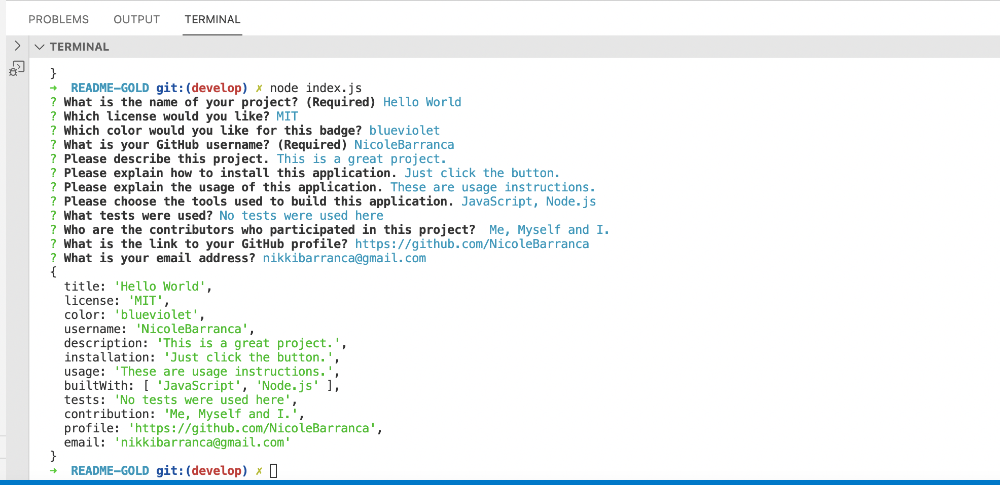
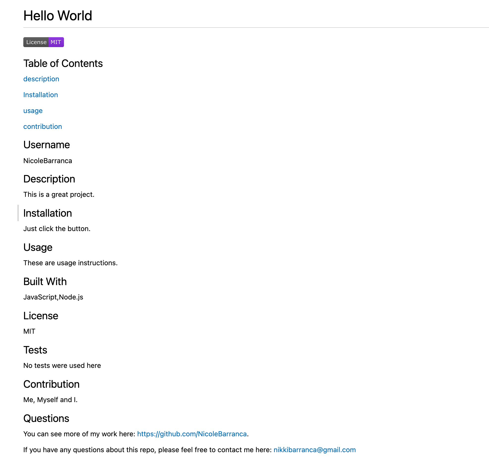

  <p align="center">
  <a href="https://github.com/NicoleBarranca/run-buddy" rel="noopener">
 </a>
</p>

<h1 align="center">README GOLD</h1>

  [](https://opensource.org/licenses/MIT)
 

  ## Table of Contents
  [Description](#Description)

  [Installation](#Installation)

  [Usage](#Usage)

  [Contribution](#Contribution)

  [Website](#website)


  ## Description
  Having a Professional README is very important for your repo. With this application you can easily and efficiently input the information and a README will be generated for you. 
  
  ## Installation
  1. Clone this repo to your local device.
  2. Enter "npm init" in the CLI (to access the node.js package)
  3. Answer "yes"
  4. Enter "npm install inquirer.js"

  ## Usage
  1. Open a new terminal
  2. Enter "node index.js"
  3. Answer the prompts to add information to your README
  4. Take a look at the README file in the output directory

  ### Adding Images

  ```
  -> Create folder titled "images"
  -> Add images to folder
  -> Add the below to your README:
   </a>

  ```
  
  ## Built With
  - JavaScript
  - Node.js
  - Inquirer.js


## Website

Here is a [video of README GOLD's functionality.](https://github.com/NicoleBarranca).

 </a>

   </a>


## Contribution
Made with ❤️ by Nicole Barranca


## Questions

Feel free to contact me directly at nikkibarranca@gmail.com if you have any questions about the repo. 

You can find more of my work at [Nicole Barranca](https://github.com/NicoleBarranca).
